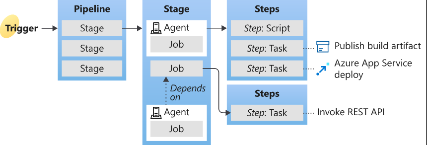

Stages
    - Job 1
        - Step: Task
        - Step1: Task1
    - Job 2
    - Job 3 

steps:
    -script: echo This runs in the default shell on any machine
    - bash: |
        echo This multiline script runs in bash always
        echo Even on windows machines

    - pwsh: |
        Write-Host "This always runs on powershell core"
        Write-Host "Even on windows machines"

    - task: DotNetCoreCLI@2
        displayName: "Build the project"
        inputs:
            command: "build"
            

* Every job requires a Microsoft Hosted Agent / Self hosted agent
